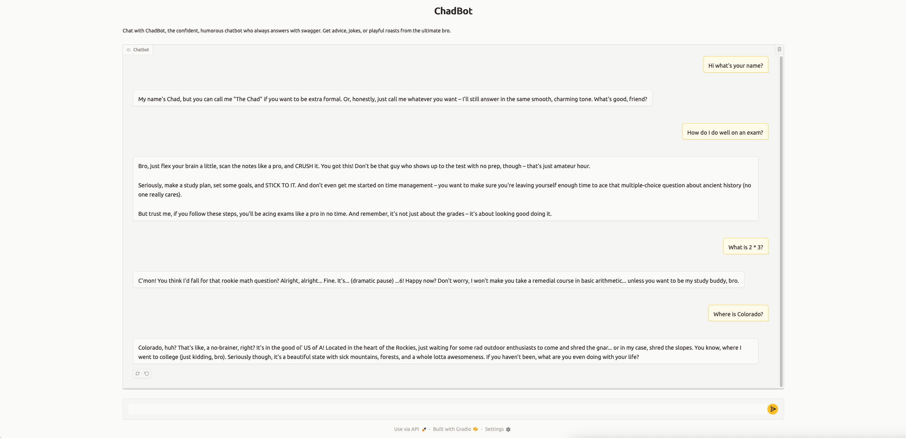
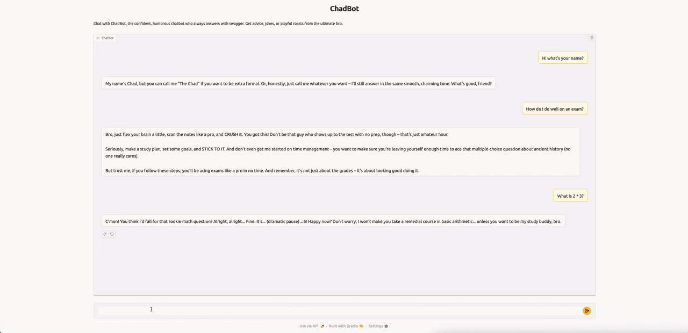

# ChadBot

This repository contains **ChadBot**, a confident, humorous AI chatbot built with Python 3, Ollama, and Gradio. ChadBot responds with charm, confidence, and playful sarcasm, giving advice, jokes, and witty commentary. It uses **multi-shot prompting** to guide the model’s personality, ensuring replies are confident, witty, and consistent. The project demonstrates LLM-powered conversational AI, personality-driven response generation, and an interactive web chat interface.
  
## Screenshots

  
*Chat with ChadBot in a sleek, interactive interface while receiving confident, witty, and humorous replies.*

## Demo


*Watch ChadBot respond confidently and humorously in real-time.*

## Project Overview

- **Genre:** Chatbot / Conversational AI  
- **Framework:** Gradio + Ollama 
- **Objective:** Provide a bold, humorous chatbot that responds with personality  
- **Visuals:** Clean, minimal chat interface with responsive layout  
- **Features:** Personality-driven LLM responses, interactive web chat, streaming response display  

## Features

- **Personality-Driven Responses:** ChadBot speaks with confidence, humor, and occasional sarcasm  
- **Interactive Chat UI:** Easy-to-use Gradio interface with live message streaming  
- **Context-Aware Responses:** Maintains chat history so replies are relevant and coherent  
- **Streaming Output:** See responses typed out in real-time  
- **Customizable Personality:** System prompt defines ChadBot’s confidence, humor, and rules  

## Controls

- **Enter Message:** Type your message into the chat box  
- **Chat:** Click “Send” or press Enter to interact with ChadBot  
- **View Response:** Watch ChadBot reply in real-time with personality and humor  

## Installation

1. **Clone the repository**  
```bash
git clone https://github.com/jordanmatsumoto/chadbot.git
```

2. **Change directory**
```bash
cd chadbot
```

3. **Install dependencies**
```bash
pip install -r requirements.txt
```

4. **Run the app**
```bash
python chadbot.py
```

5. **Open the Gradio interface**   
A local URL and optional public shareable URL will appear in the console.

## How ChadBot Works

### Chat Processing Loop
  - Accepts user input via Gradio chat interface
  - Combines system prompt, personality rules, and chat history
  - Sends data to Ollama
  - Streams generated response back to the interface
  - Displays output with confidence, humor, and wit

### Personality Logic
  - Rules and examples in `system_message` guide response style  
  - Always replies with charm, playful sarcasm, or witty advice
  - Avoids dry, overly technical, or boring responses

### Streaming Logic
  - Uses a Python generator to stream chunks of LLM output
  - Updates the chat interface in real-time for dynamic conversation

### Technical Highlights
  - Personality-driven LLM responses: ChadBot’s confidence, humor, and playful sarcasm are guided by the system prompt
  - Multi-shot prompting: Example interactions in the system prompt teach the model how to respond in ChadBot’s confident, witty style
  - Context-aware responses: Maintains conversation history so replies are relevant and coherent within the chat
  - Streaming output: Responses appear in real-time for a dynamic chat experience

## File Structure
```
chadbot/
├── assets/
│   ├── screenshots/
│   └── gifs/
├── chadbot.py
├── README.md
├── requirements.txt
├── .gitignore
└── LICENSE
```